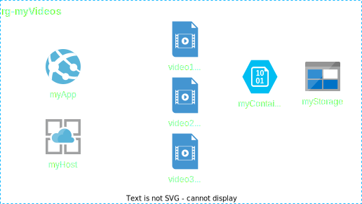

# SML : Stream My Life

## Architecture

The basic infrastructure for this includes an Azure storage account with some mp4 video files uploaded into a container, an App Service hosting a dotnet app that has a video control with the stream source to the video file in the storage account. The app will have a dropdown list of videos to choose from and a play button to start the video.

